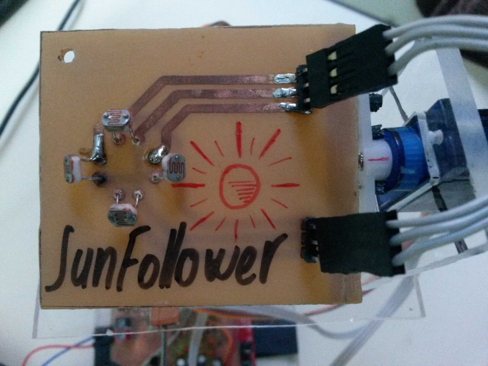
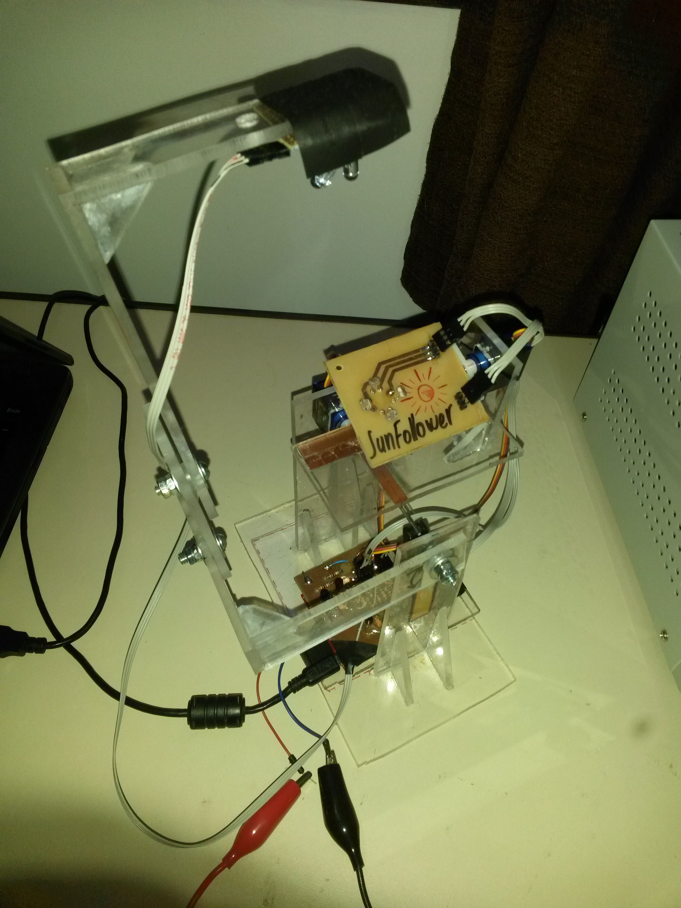

## SunFollower - just like a Sun Flower, but different

Light source tracker based on LDRs (two for each axis). The project uses Texas Instruments' msp430g2553 and
servo motors. More information is available in the file "SunFollower - Relatório.pdf", but in portuguese.

Two videos of it working can be checked out [here](https://www.youtube.com/watch?v=nvw0BELfpRg&t=7s) and [here](https://www.youtube.com/watch?v=sF1NgKuyHPw).

The project ended up looking like this:

